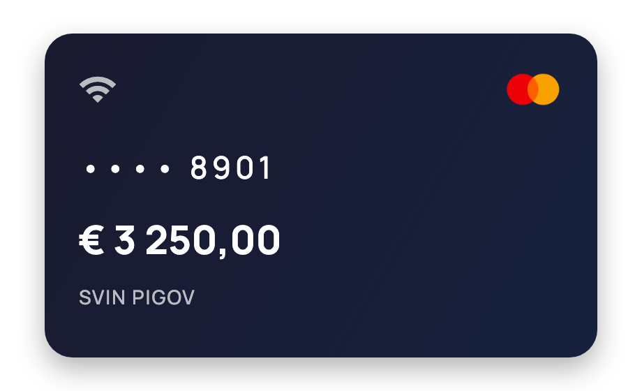
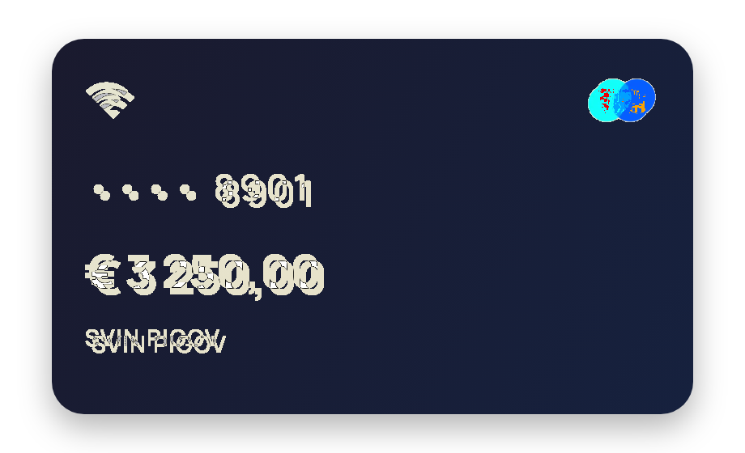
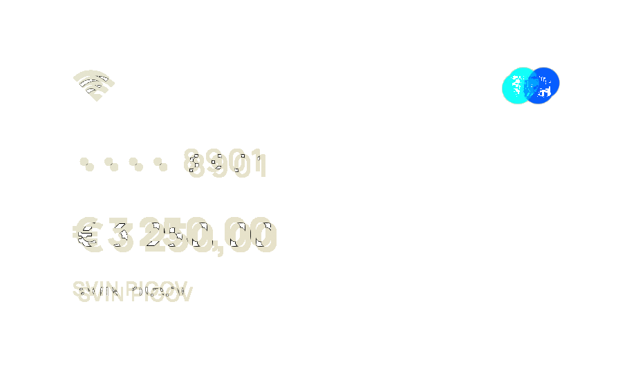

# Zoloto

[](https://pub.dev/packages/zoloto)

A set of utilities for simplifying golden (screenshot) test writing in Flutter.

Flutter supports golden tests out of the box, but production use quickly
introduces boilerplate. Zoloto eliminates this overhead so you
can focus on what matters: the widget under test.

## Core Features

- **Flexible test environments** — `TestEnvironment` describes a virtual device,
  a monitor, or a plain surface. Configure viewport size, pixel ratio, text
  scale, safe area, brightness, platform, and surface decoration in one place.
- **Multi-environment snapshots** — `expectMatchTestEnvironments` captures a
  golden PNG per environment in a single test, applying each configuration
  automatically.
- **Automatic font loading** — loads all fonts at
  setup, including cross-package fonts (Roboto, SF Pro, etc.).
- **Image precaching** — walks the widget tree before each screenshot to
  precache `Image` and `DecoratedBox` assets so goldens render correctly.
- **Configurable comparator** — `ZolotoFileComparator` supports a tolerance
  threshold for pixel diffs, with clear diff-percent logs on mismatch.
- **Simplified app configuration** — `defaultAppWrapper` and `ZolotoConfig`
  let you define your `MaterialApp` shell (theme, dark theme, localizations)
  once and reuse it across every test automatically.

## Inspiration

Zoloto is heavily inspired by
[golden_toolkit](https://pub.dev/packages/golden_toolkit), which has been
discontinued. It picks up where `golden_toolkit` left off and adds:

1. **Wider test environment control** — environments can represent not just
   devices but also monitors or plain surfaces for isolated widget testing.
2. **Explicit file comparator configuration** — transparent setup of
   `ZolotoFileComparator` with a configurable tolerance threshold.
3. **Simplified DI and base app setup** — `defaultAppWrapper` and
   `ZolotoConfig` reduce per-test boilerplate to near zero.

## Getting Started

### Installation

Add zoloto to your `pubspec.yaml`:

```yaml
dev_dependencies:
  zoloto: ^0.0.1
```

### Step 1 — Configure

Create a `flutter_test_config.dart` file at the root of your `test/` directory.
This file runs before every test file and sets up zoloto globally:

```dart
import 'dart:async';

import 'package:zoloto/zoloto.dart';

Future<void> testExecutable(FutureOr<void> Function() testMain) async {
  return Zoloto.setup(
    testMain: testMain,
    config: ZolotoConfig.defaultSetup(),
  );
}
```

To customize the app wrapper (theme, localizations, dark theme), pass your own
factory:

```dart
Future<void> testExecutable(FutureOr<void> Function() testMain) async {
  return Zoloto.setup(
    testMain: testMain,
    config: ZolotoConfig.defaultSetup(
      appWrapperFactory: () => defaultAppWrapper(
        theme: ThemeData(textTheme: myTextTheme),
        darkTheme: ThemeData.dark().copyWith(textTheme: myTextTheme),
      ),
    ),
  );
}
```

### Step 2 — Write a test

Use `testGoldenWidgets` instead of `testWidgets`, define a `TestEnvironment` for
your widget's surface, and call `expectMatchTestEnvironments` to capture a golden
PNG:

```dart
import 'package:flutter/material.dart';
import 'package:zoloto/zoloto.dart';

const _cardEnv = TestEnvironment(
  name: 'card',
  size: Size(460, 280),
  pixelRatio: 2,
  surfacePadding: EdgeInsets.all(16),
  safeArea: EdgeInsets.zero,
  platform: TargetPlatform.android,
);

void main() {
  testGoldenWidgets('bank card — mastercard', (tester) async {
    await expectMatchTestEnvironments(
      'bank_card.mastercard',
      tester: tester,
      widget: const BankCard(data: mastercardCard),
      testEnvironments: [_cardEnv],
    );
  });
}
```

### Step 3 — Run with golden update

Generate the golden files for the first time (or after intentional changes):

```shell
flutter test --update-goldens
```

### Step 4 — See the generated output

Zoloto generates **PNG** files in a `_goldens/` folder next to your test file:

```
test/
  widgets/
    bank_card_test.dart
    _goldens/
      bank_card.mastercard.card.png    ← generated golden
```

Here is what the generated golden looks like:



### Step 5 — Make a change

Now modify the widget — for example, change the inner padding from `24` to `20`:

```dart
// Before
padding: const EdgeInsets.all(24),

// After
padding: const EdgeInsets.all(20),
```

### Step 6 — Get a failure

Run the tests again **without** `--update-goldens`:

```shell
flutter test
```

The test fails because the new rendering doesn't match the stored golden:

```
══╡ EXCEPTION CAUGHT BY FLUTTER TEST FRAMEWORK ╞══════════════════════════
The following assertion was thrown while running async test code:
Golden "_goldens/bank_card.mastercard.card.png": Pixel test failed,
4.43%, 22828px diff detected.
Failure feedback can be found at
test/widgets/failures
```

Flutter generates comparison images in a `failures/` folder next to the test:

| Masked diff | Isolated diff |
|:-:|:-:|
|  |  |

To accept the new look, run `flutter test --update-goldens` again.

## Advanced Usage

### Comparator tolerance

By default `ZolotoFileComparator` uses zero tolerance — any pixel difference
fails the test. To allow minor rendering variations, pass a custom
`comparatorFactory`:

```dart
ZolotoConfig.defaultSetup(
  comparatorFactory: (testFile) =>
      ZolotoFileComparator(testFile, toleranceThreshold: 0.005),
);
```

A threshold of `0.005` allows up to 0.5% pixel difference before failing.

### Single-widget snapshots without environments

For simple cases where you don't need a full `TestEnvironment`, use
`pumpGoldenWidget` + `expectMatchGolden`:

```dart
testGoldenWidgets('avatar widget', (tester) async {
  await pumpGoldenWidget(tester, const Avatar(url: mockUrl));
  await expectMatchGolden(tester, 'avatar');
});
```

This produces a single `_goldens/avatar.png` file without any environment
configuration.

### Custom golden folder and file paths

Change the folder name with `goldenFolderName` and organize generated files
into subfolders with `testPathFactory`:

```dart
ZolotoConfig.defaultSetup(
  goldenFolderName: 'snapshots',
  testPathFactory: (name, testEnv) {
    if (testEnv == null) return '$name.png';
    return '${testEnv.platform.name}/$name.${testEnv.name}.png';
  },
);
```

This generates files like `snapshots/android/bank_card.card.png`.

### Custom test environments

`TestEnvironment` is not limited to real devices. Create environments for
specific testing scenarios — dark/light theme, accessibility, or custom
surfaces:

```dart
const darkThemeEnv = TestEnvironment(
  name: 'dark',
  size: Size(400, 300),
  brightness: Brightness.dark,
);

const a11yLargeText = TestEnvironment(
  name: 'a11y_large',
  size: Size(400, 600),
  textScale: 2.0,
);

testGoldenWidgets('button — themes & a11y', (tester) async {
  await expectMatchTestEnvironments(
    'button',
    tester: tester,
    widget: const MyButton(label: 'Submit'),
    testEnvironments: [darkThemeEnv, a11yLargeText],
  );
});
```

### Auto-height for scrollable content

When testing scrollable widgets, set `autoHeight: true` to expand the surface
to fit all content:

```dart
testGoldenWidgets('long list', (tester) async {
  await expectMatchTestEnvironments(
    'long_list',
    tester: tester,
    widget: const ItemList(),
    testEnvironments: [
      TestEnvironments.iphone13Mini.copyWith(autoHeight: true),
    ],
  );
});
```

### Disabling font loading

By default zoloto loads all fonts from `FontManifest.json`. To skip this and
use only the default Ahem font, set `shouldLoadFonts: false`:

```dart
ZolotoConfig.defaultSetup(
  shouldLoadFonts: false,
);
```

### Custom app wrapper

You can (and are encouraged to) fully configure the `MaterialApp` wrapper to
match your production app — themes, localizations, navigation, DI:

```dart
ZolotoConfig.defaultSetup(
  appWrapperFactory: () => (child) => MaterialApp(
    theme: appTheme,
    darkTheme: appDarkTheme,
    localizationsDelegates: AppLocalizations.localizationsDelegates,
    supportedLocales: AppLocalizations.supportedLocales,
    home: child,
  ),
);
```

### Overriding and filtering environments

Override the global `testEnvironments` per test or filter them by specific
criteria:

```dart
// Override: use completely custom environments
testGoldenWidgets('card — tablets', (tester) async {
  await expectMatchTestEnvironments(
    'card.tablets',
    tester: tester,
    widget: const MyCard(),
    testEnvironments: [ipadEnv, androidTabletEnv],
  );
});

// Filter: run only iOS environments from config defaults
testGoldenWidgets('screen — iOS only', (tester) async {
  await expectMatchTestEnvironments(
    'screen.ios',
    tester: tester,
    widget: const MyScreen(),
    filter: (env) => env.platform == TargetPlatform.iOS,
  );
});
```

## CI/CD Usage

> **⚠️ Warning:** Golden test output can vary significantly between platforms
> (macOS, Linux, Windows) due to differences in text rendering, anti-aliasing,
> and graphics backends. Golden files generated on one platform may not match
> on another.

Generate golden files on the **same machine (or the same OS/environment)** where
they will be verified. If your CI runs on Linux, generate the goldens on Linux
too. Otherwise you may encounter false failures caused by platform rendering
differences, not actual widget changes.

## Example

The [example](example/) project demonstrates the full setup: configuration,
widget tests, screen tests with multiple devices, custom environments, scroll
interactions, and auto-height surfaces.

## License

This project is licensed under the MIT License — see the [LICENSE](LICENSE) file
for details.

## Acknowledgements

Thanks to the **Surf Flutter Team 2025** for inspiration and support ❤️